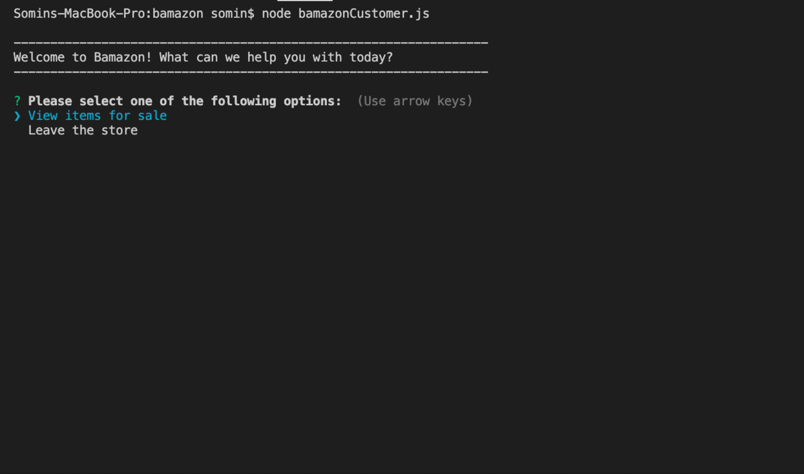
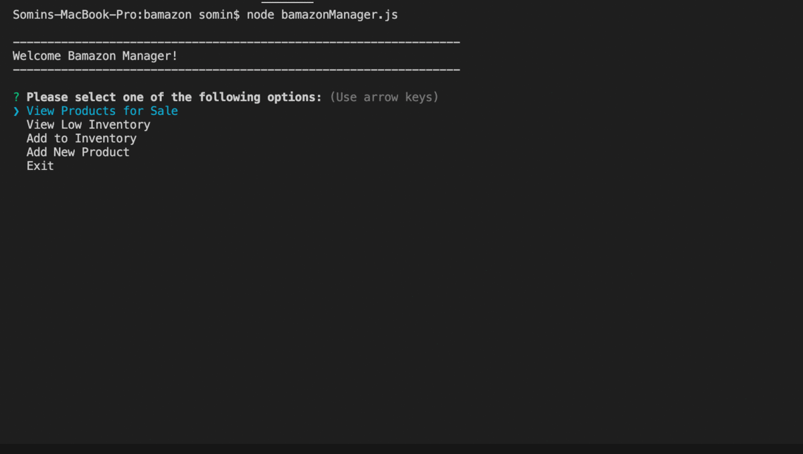
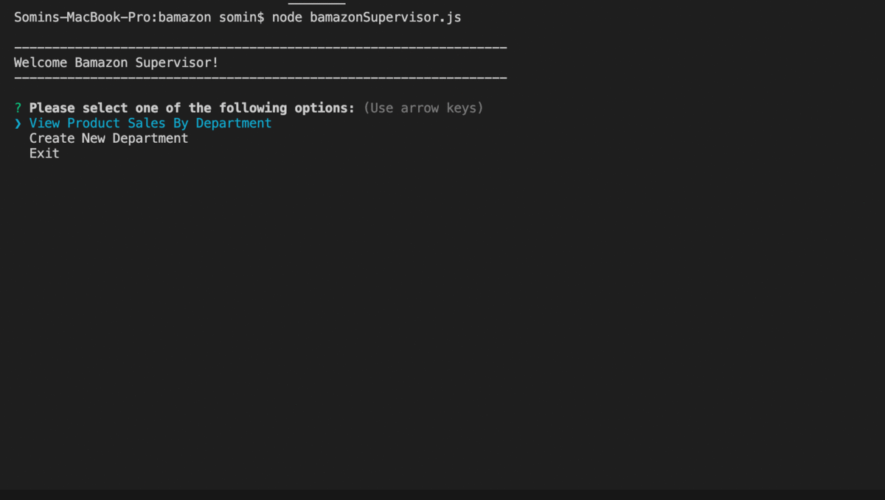

# Bamazon
Amazon-like storefront with the MySQL and Node app. Customers, managers, and supervisors are able to use this app. Customers to view items and place orders, for managers to perform inventory control and add new products, and for supervisors to track department profitability and add new departments.

# Installation:
1. Install [Node js](https://nodejs.org/en/) and [MySQL](https://www.mysql.com/)
2. Clone the Bamazon repository to your computer
3. Run the npm install 
4. Open MySQL Workbench and the "bamazon.sql" script from the cloned repo
5. Create a pw.js file and add your password to access your root server to that file. This file is a dependency for the app. If you do not require a password to access your root, simply leave the pw property as an empty string.

# Instructions:
<h3>Customers View</h3>

- Select the options either to view items or leave.
- If you select view items, input and enter the item id
- Input and enter the quantity that you would like to purchase
- If you would like to buy another item, repeat
- If you would like to leave, click exit

<h3>Managers View</h3>

- Select the options either to view products for sale, view low inventory, add to inventory, add new product, or exit.
- If you select add to inventory, follow the prompts for item id to increase inventory on and quantity to increase inventory
- If you select add new product, follow the prompts for item name, department, price, and quantity in stock
- When you are ready to leave, click exit

<h3>Supervisors View</h3>

- Select the options either to view product sales by department, create a new department, or exit.
- If you select create new department, follow the prompts for department name and overhead costs
- When you are ready to leave, click exit

